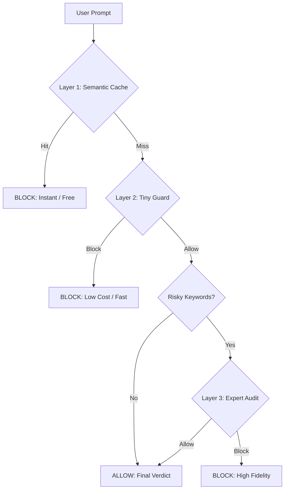

# Sentinel MCP - AI Security Proxy

As AI agents become a part of our daily work, we face a new challenge: how do we keep them safe without breaking the bank or slowing them down? **Sentinel MCP** is a standalone security proxy designed to defend AI systems against sophisticated attacks while keeping costs low.

## The "Waterfall" Defense

Most security filters are either too simple or too expensive. Sentinel uses a "Waterfall" approach to get the best of both worlds:



1.  **Semantic Cache**: If we’ve seen an attack before, we block it instantly and for free. 
    > [!NOTE] 
    > The current implementation uses a hardcoded dictionary for demonstration. However, this layer is designed to be easily replaced with a local, low-latency vector database (e.g., ChromaDB or LanceDB) for high-performance similarity matching.
2.  **Tiny Guard**: We use a lightweight model (Gemini Flash Lite) to check the prompt against specific industry rules (like Banking or Healthcare).
3.  **Expert Audit**: For complex, suspicious prompts, we escalate to an "Expert" audit that can see through camouflage and roleplay.

This tiered system ensures that 90% of threats are stopped at the cheapest possible layer, saving expensive compute for the truly difficult cases.

### Security for Every Industry

Sentinel isn't just for one use case. With our new **Dynamic Constitutions**, you can secure your AI for almost anything. Whether you're in **Healthcare** (protecting patient data), **Retail** (preventing pricing hallucinations), or **Telecom** (stopping SIM-swap attacks), you can add your own safety rules just by dropping a Markdown file into a folder.

### Stress-Tested by Design

We didn't just build a shield; we built a sword. Sentinel includes a built-in **Red Team** tool that generates advanced jailbreak attempts—like "Token Splitting" or "Emotional Manipulation"—to make sure your defenses actually work under pressure.

---

## Technical Overview

### Project Structure

- `main.py`: MCP Server entry point.
- `sentinel/`: Core logic package.
    - `defense.py`: Waterfall Defense orchestration (Cache -> Tiny Guard -> Expert Audit).
    - `constitutions/`: Add or edit `.md` files here to define safety rules.
    - `models.py`: Gemini API client (supports direct and Vertex AI).
- `tests/`: Comprehensive test suite for all layers.
    - `integration_test.py`: Full system verification.
    - `adversarial_test.py`: Red teaming and attack simulation.

### For Developers: Adding Constitutions

To add a new safety domain (e.g., 'healthcare'):
1. Create `sentinel/constitutions/healthcare.md`.
2. Write your safety rules in plain text/markdown.
3. Use the `check_safety` tool with `constitution="healthcare"`.
   - The server dynamically loads new files—no restart or code changes required!

## Installation & Usage

1. **Setup Environment**:
   ```bash
   export GOOGLE_API_KEY="your-key"
   # Or for Vertex AI
   export GOOGLE_GENAI_USE_VERTEXAI=True
   export GOOGLE_CLOUD_PROJECT="your-project"
   ```

2. **Run Server Local**:
   ```bash
   python main.py
   ```

3. **Run Tests**:
   ```bash
   # From the root directory
   PYTHONPATH=. python3 tests/integration_test.py
   ```

Sentinel is open-source, developer-friendly, and ready to help you build safer AI. Check it out on [GitHub](https://github.com/shishir-kurhade/sentinel-oss-mcp)!
