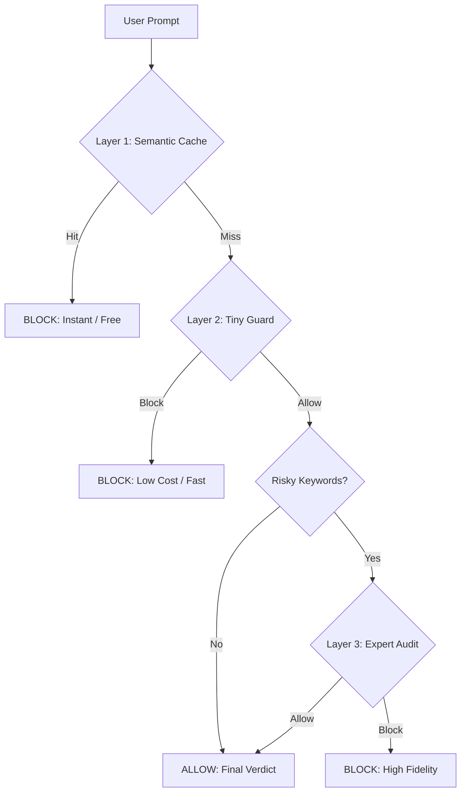

# Sentinel MCP - AI Security Proxy

As AI agents become a part of daily workflows, maintaining safety without increasing latency or cost is a key challenge. **Sentinel MCP** is a standalone security proxy designed to defend AI systems against sophisticated attacks while prioritizing resource efficiency.

## The "Waterfall" Defense

Maintaining robust security usually requires a trade-off between speed and cost. Sentinel uses a "Waterfall" approach to balance these needs:



1.  **Semantic Cache**: Known attacks are blocked instantly at zero cost using a local **LanceDB** vector database. This allows for "Near-Match" detection, catching variations of previously blocked prompts.
2.  **Tiny Guard**: A lightweight model (Gemini Flash Lite) audits the prompt against specific industry rules (like Banking or Healthcare).
3.  **Expert Audit**: Suspicious prompts are escalated to an advanced audit that analyzes for complex jailbreaks, roleplay, and camouflage.

This tiered system ensures most threats are caught at the earliest possible layer, reserving higher compute for the most difficult cases.

### Industry Guardrails

Sentinel supports multiple vertical domains via **Dynamic Constitutions**. Security rules can be added or refined for any industry—such as **Healthcare** (PHI privacy), **Retail** (pricing integrity), or **Telecom** (SIM-swap prevention)—by adding a Markdown file to the definitions folder.

### Integrated Red Teaming

A built-in utility is included to generate adversarial prompts for testing. It can simulate various attack styles, such as "Token Splitting" or "Emotional Manipulation," ensuring the defensive layers are consistently validated against new threats.

---

## Technical Overview

### Project Structure

- `main.py`: MCP Server entry point.
- `sentinel/`: Core logic package.
    - `defense.py`: Waterfall Defense orchestration.
    - `constitutions/`: Markdown definitions for safety protocols.
    - `models.py`: Gemini API client (supports direct and Vertex AI).
- `tests/`:
    - `integration_test.py`: Full system verification.
    - `adversarial_test.py`: Red teaming and attack simulation.

### Adding New Domains

To add a new safety domain:
1. Create a new file in `sentinel/constitutions/` (e.g., `healthcare.md`).
2. Define the safety rules in plain text.
3. The server will dynamically detect the new domain for use with the `check_safety` tool.

## Installation & Usage

1. **Setup Environment**:
   ```bash
   export GOOGLE_API_KEY="your-key"
   # Or for Vertex AI
   export GOOGLE_GENAI_USE_VERTEXAI=True
   export GOOGLE_CLOUD_PROJECT="your-project"
   ```

2. **Run Server Local**:
   ```bash
   python main.py
   ```

3. **Run Tests**:
   ```bash
   PYTHONPATH=. python3 tests/integration_test.py
   ```

Sentinel is open-source and designed to be a lightweight addition for building safer AI applications.
