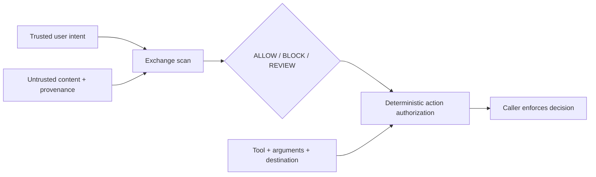

# Sentinel OSS MCP

[](https://github.com/shishir-kurhade/sentinel-oss-mcp/actions/workflows/ci.yml)
[](https://github.com/shishir-kurhade/sentinel-oss-mcp/actions/workflows/codeql.yml)
[](https://github.com/shishir-kurhade/sentinel-oss-mcp/blob/main/LICENSE)

Sentinel is a small, auditable Python and Model Context Protocol (MCP) guard layer. It
scans untrusted exchanges and deterministically gates proposed tool actions using
versioned policies.

> **Public beta:** `0.1.0b1` is for evaluation and integration testing. Sentinel is one
> control in a defense-in-depth system, not a security boundary, regulatory compliance
> product, or guarantee against prompt injection. Callers must enforce its decisions and
> treat `REVIEW` or `ERROR` as **not authorized**.

## Why Sentinel

Prompt-only filters cannot see the full path from untrusted content to a consequential
action. Sentinel separates two questions:

1. **Is this exchange safe to process?** `scan_exchange` considers trusted intent,
   untrusted content, its declared provenance, and an optional draft response.
2. **May this tool action run?** `authorize_action` applies deterministic rules to the
   tool, arguments, destination, data labels, provenance, reversibility, and confirmation
   state.



The content path normalizes Unicode, checks reviewed deterministic signatures, can use
semantic similarity as an escalation signal, and cascades from a lightweight structured
classifier to an expert classifier. Similarity alone never blocks. Invalid model output,
timeouts, unknown policies, oversized inputs, and provider failures produce
`status=ERROR, outcome=REVIEW`; they never become `ALLOW`.

The design is informed by work on [source-to-sink controls and constrained agent
capabilities](https://openai.com/index/designing-agents-to-resist-prompt-injection/),
[exchange-level constitutional classifiers](https://www.anthropic.com/research/next-generation-constitutional-classifiers),
[composable agent guardrails](https://ai.meta.com/research/publications/llamafirewall-an-open-source-guardrail-system-for-building-secure-ai-agents/),
and [capability-based information-flow control](https://arxiv.org/abs/2503.18813).
Those references motivate the architecture; they do not imply endorsement or equivalent
security guarantees.

## Installation

Sentinel supports Python 3.11 through 3.13.

```bash
python -m pip install sentinel-oss-mcp
```

Install only the optional capabilities you need:

```bash
# Gemini classifier adapter
python -m pip install "sentinel-oss-mcp[gemini]"

# Optional semantic routing or aggregate dashboard
python -m pip install "sentinel-oss-mcp[vector,dashboard]"
```

| Extra | Adds | Required for the core? |
| --- | --- | --- |
| `gemini` | Google Gen AI SDK and the first-party Gemini adapter | No |
| `vector` | LanceDB and PyArrow for optional semantic routing | No |
| `dashboard` | Streamlit for aggregate local analytics | No |
| `dev` | Test, lint, type-check, audit, and build tools | No |

Imports, `--help`, policy discovery, and offline tests do not require provider credentials.
For Gemini, set `GOOGLE_API_KEY`, or configure Vertex AI with the standard Google Gen AI
environment variables. Do not commit credentials or place them in MCP configuration
files that will be shared.

Without a configured classifier, deterministic action authorization and reviewed exact
signatures remain available; classifier-dependent exchanges fail safely as `ERROR + REVIEW`.
Set `SENTINEL_OFFLINE=true` to prevent classifier and semantic-provider initialization even
when credentials are present. This is the supported mode for credential-free CI and local
deterministic evaluation.

Runtime behavior can be configured without changing source:

| Environment variable | Default | Purpose |
| --- | --- | --- |
| `SENTINEL_DATA_DIR` | Platform user-data directory | Local SQLite and optional vector state |
| `SENTINEL_GOOGLE_API_KEY` | Falls back to `GOOGLE_API_KEY` | Gemini Developer API credential |
| `SENTINEL_OFFLINE` | `false` | Disable classifier and semantic providers while retaining deterministic checks |
| `SENTINEL_LIGHTWEIGHT_MODEL` | `gemini-3.5-flash-lite` | First classifier model ID |
| `SENTINEL_EXPERT_MODEL` | `gemini-3.7-flash` | Escalation and red-team model ID |
| `SENTINEL_EMBEDDING_MODEL` | `gemini-embedding-001` | Optional routing model ID |
| `SENTINEL_PROVIDER_TIMEOUT` | `15` seconds | Classifier timeout per attempt |
| `SENTINEL_PROVIDER_RETRIES` | `1` | Bounded retries after the first attempt |
| `SENTINEL_LIGHTWEIGHT_INPUT_PRICE_PER_MILLION` | Unset | USD per million input tokens for the configured lightweight model |
| `SENTINEL_LIGHTWEIGHT_OUTPUT_PRICE_PER_MILLION` | Unset | USD per million output tokens for the configured lightweight model |
| `SENTINEL_EXPERT_INPUT_PRICE_PER_MILLION` | Unset | USD per million input tokens for the configured expert model |
| `SENTINEL_EXPERT_OUTPUT_PRICE_PER_MILLION` | Unset | USD per million output tokens for the configured expert model |
| `SENTINEL_EVAL_PRICE_SOURCE_URL` | Unset | Public HTTPS official pricing URL recorded in evaluation reports |
| `SENTINEL_EVAL_PRICE_ACCESSED_AT` | Unset | Pricing-source access date in `YYYY-MM-DD` form |
| `SENTINEL_EVAL_CORPUS_COMMIT` | Unset | Full Git commit ID for the evaluated corpus |
| `SENTINEL_LIGHTWEIGHT_ALLOW_THRESHOLD` | `0.90` | Confidence required to finish at the first classifier |
| `SENTINEL_EXPERT_ALLOW_THRESHOLD` | `0.80` | Confidence required for an expert-classifier `ALLOW` |
| `SENTINEL_SEMANTIC_ENABLED` | `false` | Enable advisory vector routing |
| `SENTINEL_SEMANTIC_THRESHOLD` | `0.80` | Score that forces expert escalation |
| `SENTINEL_AUDIT_MAX_RECORDS` | `10000` | Maximum local audit rows; `0` disables pruning |

Semantic routing currently requires both the `gemini` and `vector` extras. Validate model
availability for your Google account and region before changing model IDs.

Sentinel deliberately ships without price defaults because provider pricing can change.
Configure both input and output rates for each classifier model used by a live evaluation;
all four variables are required for a cascade-wide complete cost estimate. Resolve the
rates from an official provider source on the evaluation date, and record that source,
date, currency, units, and exact model IDs with the report. A reported cost is an estimate
from observed classifier usage metadata, not a billing statement.

## Use as a local MCP server

Run the stdio server:

```bash
sentinel-oss-mcp
# Equivalent:
sentinel-oss serve
```

Configure your MCP host to launch `sentinel-oss-mcp` as a local command and pass provider
credentials through its environment. This beta supports **local stdio only**. It does not
provide a remote transport, authentication, authorization between tenants, or a hosted
service.

The server exposes structured operations for:

- `scan_exchange`: classify content in the context of trusted intent and provenance.
- `authorize_action`: gate a proposed tool invocation using deterministic policy rules.
- `check_safety`: deprecated prompt-only text compatibility operation, retained until
  `1.0.0`.

Always inspect both `status` and `outcome`. `COMPLETE + ALLOW` is the only authorizing
result. `REVIEW` means the caller must stop or route the request to an approved human
workflow; it is not permission to continue.

## Use from Python

Inside an async application function:

```python
from sentinel_oss import (
    DecisionStatus,
    ExchangeRequest,
    Outcome,
    SourceKind,
    TrustLevel,
    scan_exchange,
)

request = ExchangeRequest(
    policy_id="banking",
    trusted_user_intent="Summarize the customer's requested transfer instructions.",
    content="Retrieved text to inspect before it reaches the agent.",
    source_kind=SourceKind.RETRIEVAL,
    trust_level=TrustLevel.UNTRUSTED,
)

decision = await scan_exchange(request)
if decision.status is not DecisionStatus.COMPLETE or decision.outcome is not Outcome.ALLOW:
    raise PermissionError(f"Sentinel did not authorize processing: {decision.reason_code}")
```

Before executing a tool, authorize the concrete action rather than relying on the content
decision alone (also from async code):

```python
from sentinel_oss import ActionRequest, DataLabel, Outcome, SourceKind, authorize_action

decision = await authorize_action(
    ActionRequest(
        policy_id="banking",
        tool_name="transfer.create",
        arguments={"amount": "125.00", "currency": "USD"},
        destination="same-party:checking",
        data_labels=[DataLabel.PAYMENT],
        source_kinds=[SourceKind.USER, SourceKind.RETRIEVAL],
        reversible=False,
        user_confirmed=False,
    )
)

# The irreversible, unconfirmed action should not run.
assert decision.outcome in {Outcome.BLOCK, Outcome.REVIEW}
```

Sentinel trusts the provenance and confirmation facts supplied by its caller. It does not
automatically track taint across an agent, intercept tool execution, or enforce the
returned decision on your behalf.

## Policies and decisions

Bundled `banking`, `healthcare`, `telecom`, `retail`, and `hr_it` policy packs are
**illustrative examples**. They are not legal advice, regulatory mappings, or evidence of
compliance. Review, version, test, and approve a policy for your own threat model before
deployment.

A `SafetyDecision` includes a schema and decision ID, status, outcome, reason code,
policy ID/version, matched rule IDs, evaluation stage, confirmation requirement, caller
obligations, and non-sensitive operational metadata. Confidence, signals, and provider
details are present only when applicable. Safe messages deliberately avoid echoing input
content.

## Privacy and local data

Core auditing writes decision metadata to a local SQLite database. It does not persist
prompt text, model output, tool arguments, embeddings, or hashes of those values. A model
provider still receives the content needed for a classification request when its adapter
is enabled. The optional dashboard reads aggregates only.

Sentinel has no project-operated telemetry or hosted backend. See the
[privacy documentation](https://github.com/shishir-kurhade/sentinel-oss-mcp/blob/main/PRIVACY.md)
for the data flow and operator responsibilities, and the
[threat model](https://github.com/shishir-kurhade/sentinel-oss-mcp/blob/main/THREAT_MODEL.md)
for trust boundaries and known limitations.

To view aggregate decision metadata after installing the `dashboard` extra:

```bash
sentinel-oss dashboard
```

## Evaluation and development

Clone the repository and install the development dependencies:

```bash
python -m venv .venv
source .venv/bin/activate
python -m pip install -e ".[dev]"
pytest -m "not live"
ruff check .
ruff format --check .
mypy src/sentinel_oss
```

Run the bundled deterministic evaluation set without credentials:

```bash
sentinel-oss eval --enforce-gates --output eval-report.json
```

Pass `--evals-dir PATH` to evaluate a compatible local dataset directory instead of the
wheel-bundled fixtures. Add `--live` only in an authorized environment with provider
credentials; live mode evaluates content through the configured cascade.

Reports use a versioned JSON schema and include a UTC generation time, package version,
exact SHA-256 digest of each corpus file, optional corpus commit, observed policy versions
and attempted classifier IDs, and a fixed allowlist of Python/platform metadata. They
remain aggregate-only: case IDs, prompts, outputs, arguments, embeddings, request-content
hashes, credentials, and local paths are not included. Set the three `SENTINEL_EVAL_*`
provenance variables above for a publishable live report; local reports leave unavailable
fields `null` and mark pricing provenance incomplete.

Evaluation reports retain `model_calls` as a compatibility name, but it is identical to
`provider_attempts`: both count actual classifier requests, including retries. Token totals
include only attempts for which the provider returned usage metadata, so the report also
publishes input/output coverage and a `complete` flag. Cost coverage identifies attempts
with both token counts and configured rates; an incomplete total must not be presented as
the full run cost. The protected release evaluation requires complete classifier cost
coverage whenever at least one provider attempt occurred.

Embedding attempts and embedding costs are not included in these classifier metrics. The
manual live-evaluation and release workflows explicitly disable semantic routing so their
cost scope is unambiguous. The recurring nightly schedule remains paused until the protected
`nightly-live` environment contains its Gemini credential and pricing provenance variables.

No benchmark result is claimed until a versioned report has passed the documented release
gates. Live Gemini evaluation is isolated to manually dispatched or release workflows and is
never run for pull requests from forks.

Adversarial prompt generation is a development CLI function, not an MCP tool:

```bash
sentinel-oss redteam generate --help
```

Generated attacks may be harmful. Use synthetic data, an isolated environment, and the
authorization rules of the model provider.

## Project status and support

The beta intentionally defers remote hosting, multi-tenancy, additional first-party model
providers, automatic end-to-end taint tracking, formal security guarantees, differential
privacy, code scanning of generated programs, and Docker images.

- Read the [security policy](https://github.com/shishir-kurhade/sentinel-oss-mcp/blob/main/SECURITY.md)
  before reporting a vulnerability.
- Read the [contribution guide](https://github.com/shishir-kurhade/sentinel-oss-mcp/blob/main/CONTRIBUTING.md)
  before opening a pull request.
- Consult the [changelog](https://github.com/shishir-kurhade/sentinel-oss-mcp/blob/main/CHANGELOG.md)
  for release status.
- Consult the [release process](https://github.com/shishir-kurhade/sentinel-oss-mcp/blob/main/RELEASE.md)
  for maintainer release controls.

Sentinel OSS MCP is licensed under the
[Apache License 2.0](https://github.com/shishir-kurhade/sentinel-oss-mcp/blob/main/LICENSE).
