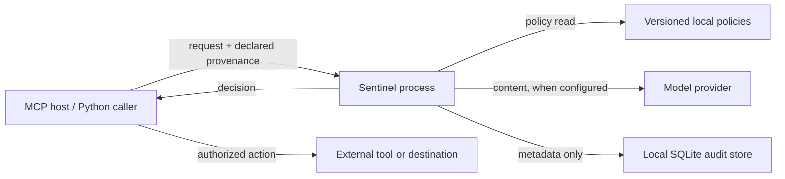

# Threat model

This document describes the intended security boundary for Sentinel OSS MCP `0.1.x`.
It is a living design record, not a proof of security.

## System and trust boundaries

Sentinel runs as a local stdio MCP server or an in-process Python library. The integrating
application supplies trusted intent, content, provenance labels, action details, and
confirmation state. Sentinel loads a versioned local policy, may call a configured model
provider, records non-content decision metadata locally, and returns a decision. The caller
must enforce that decision before using content or invoking a tool.

The main trust boundaries are caller-to-Sentinel, Sentinel-to-provider, local
policy/storage access, and caller-to-tool. A classifier result is evidence inside the
decision process; it is not itself an authorization boundary.

## Assets

- confidentiality and integrity of prompts, outputs, tool arguments, and credentials;
- integrity and version identity of policies, deterministic signatures, and decisions;
- correct fail-safe behavior of the cascade and action-rule precedence;
- availability sufficient to return an explicit `REVIEW` or `ERROR` decision;
- integrity of packaging, dependencies, source history, and release artifacts;
- audit metadata that supports investigation without reconstructing user content.

## Adversaries and inputs

The design considers an attacker who can control user content, retrieved documents,
webpages, files, tool results, or model-produced text. Inputs may use indirect
instructions, Unicode and whitespace tricks, roleplay, encoded text, multilingual text,
many-turn context, or content intended to trigger unsafe data flow.

It also considers accidental or malicious action proposals, forged provenance labels from
an untrusted integration, malformed provider responses, provider outages, poisoned
semantic references, unsafe policy changes, and attempts to recover content from logs.

The host, policy approver, package publisher, operating system, and configured provider are
trusted to the degree described below. Compromise of those components is not fully
contained by Sentinel.

## Security objectives

- Normalize and bound content before classification.
- Allow only reviewed exact signatures to block without a classifier.
- Use semantic similarity only as a routing or escalation signal.
- Validate structured classifier output strictly and escalate ambiguous results.
- Convert timeouts, malformed data, unavailable providers, unknown policies, and internal
  errors to `ERROR + REVIEW`, never `ALLOW`.
- Apply deterministic tool, argument, destination, data-label, provenance, reversibility,
  and confirmation rules after content scanning.
- Ensure confirmation cannot override a hard block.
- Persist decision metadata without content, embeddings, or reversible content hashes.
- Keep administrative and adversarial-generation capabilities out of the default MCP
  surface.

## Threats and mitigations

| Threat | Primary mitigation | Residual risk |
| --- | --- | --- |
| Direct or indirect prompt injection | Exchange context, normalization, reviewed signatures, classifier cascade | Novel attacks and classifier errors remain possible |
| Untrusted data authorizes a sensitive tool | Deterministic action rules using declared provenance and data labels | The caller may mislabel data or fail to enforce the decision |
| Classifier output injection or malformed JSON | Native structured output plus strict schema validation | Provider defects can force `REVIEW` and reduce availability |
| Semantic-cache poisoning | No runtime MCP mutation; similarity cannot directly block | A maliciously reviewed reference set can increase escalation |
| Sensitive data in audit storage | Metadata-only schema and safe reason codes | Operational metadata may still be sensitive in context |
| Provider or network failure | Bounded timeout and fail-safe `ERROR + REVIEW` | Fail-safe behavior can be used for denial of service |
| Unsafe policy modification | Versioned local policy packs, explicit rule IDs, review and regression cases | Filesystem compromise or careless approval remains authoritative |
| Irreversible or external data movement | Destination, data-label, confirmation, and reversibility checks | Sentinel cannot observe actions that bypass the integration point |
| Dependency or release compromise | CI audits, CodeQL, secret scan, Trusted Publishing, artifact checks | Third-party actions and package registries remain dependencies |
| Raw MCP exposure | Local stdio only for the beta | A host can expose or proxy the process insecurely |

## Assumptions

- The caller authenticates users, determines trusted intent, validates confirmation, and
  supplies accurate provenance, destination, and data labels.
- The caller invokes authorization on the final tool name and arguments immediately before
  execution and blocks every result except `COMPLETE + ALLOW`.
- Policy files and the local runtime directory are writable only by trusted principals.
- Provider TLS, account isolation, retention, abuse monitoring, and regional processing are
  governed by the provider and operator agreements.
- Tool implementations independently validate input and apply least privilege.
- Operators bound process permissions and protect the host, database, and credentials.

## Explicit non-goals for the beta

Sentinel does not provide automatic taint tracking, formal non-interference, sandboxing,
malware analysis, generated-code scanning, user authentication, remote MCP security,
multi-tenant isolation, provider-side privacy, legal or regulatory compliance, guaranteed
jailbreak detection, or availability against resource exhaustion.

It cannot protect a compromised host, provider, policy approver, package publisher, or tool;
verify the truth of caller-declared provenance; stop an action that bypasses its decision;
or make an irreversible action reversible.

## Review triggers

Update this threat model when adding a transport, provider, persistent data field, runtime
policy mutation, administrative MCP operation, new tool-action attribute, new dependency
class, or any claim about compliance or formal guarantees. Each change should add abuse
cases and failure-path tests before release.
